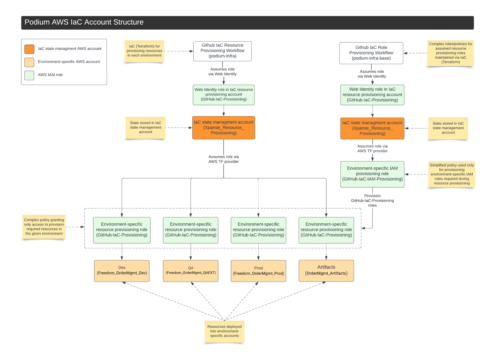

# IMS Infra Base
Setup of environment-specific resource provisioning roles to be assumed during IAC provisioning workflows

## Purpose
Hand-managing resource provisioning roles within each environment is time consuming and error-prone. This repository is responsible for maintaining those roles.

## Operation
In accordance with best practices, within our resource provisioning workflows, we use a single role (`GitHub-IaC-Provisioning`) tied to our execution account (`Xpanse_Resource_Provisioning`). This role is defined as a [web identity](https://docs.github.com/en/actions/deployment/security-hardening-your-deployments/configuring-openid-connect-in-amazon-web-services), so it can be assumed by Github during provisioning workflows. While executing provisioning workflows, this role assumes an environment-specific role (`GitHub-IaC-Provisioning`) to provision a given environment's resources.

Centralizing execution and using assumable, environment-specific, IAC managed roles gives us:
* A single account to store state buckets for all environments (with each environment having its own bucket)
* Separation between storage of Terraform state and other resources it provisions, avoiding state corruption due to a misconfiguration
* Environment-specific provisioning roles/policies using the least-priviledge principle
* Auditing and review of changes to resource provisioning roles/policies via pull requests
* A history of changes to resource provisioning roles/policies in source control
* An automated way to deploy changes to resource provisioning roles/policies

## Account/Provisioning Structure


[Lucidchart source](https://lucid.app/lucidchart/bd05b912-ddfd-47da-b447-4a2483ab4759/edit?viewport_loc=-530%2C-23%2C3072%2C1448%2C0_0&invitationId=inv_537e67d3-152c-4039-ba62-989b0fb10107)

## Implementation

### Execution Role

A web identity execution role (`GitHub-IaC-Provisioning`) should be created in the execution account (`Xpanse_Resource_Provisioning`), referencing the configured [Github OIDC provider](https://docs.github.com/en/actions/deployment/security-hardening-your-deployments/configuring-openid-connect-in-amazon-web-services) in AWS using the following settings. The resources specified in the `sts` statement block should correspond to the ARNs of the assumed roles in each environment.

#### Permissions
```
{
    "Version": "2012-10-17",
    "Statement": [
        {
            "Sid": "bucket",
            "Effect": "Allow",
            "Action": [
                "s3:GetBucketPublicAccessBlock",
                "s3:PutEncryptionConfiguration",
                "s3:GetEncryptionConfiguration",
                "s3:PutBucketPublicAccessBlock",
                "s3:PutBucketPolicy",
                "s3:CreateBucket",
                "s3:ListBucket",
                "s3:GetBucketVersioning",
                "s3:GetBucketPolicy",
                "s3:PutBucketVersioning"
            ],
            "Resource": [
                "arn:aws:s3:::ims-infra-base-state-*",
                "arn:aws:s3:::ims-infra-state-*"

            ]
        },
        {
            "Sid": "bucketobject",
            "Effect": "Allow",
            "Action": [
                "s3:PutObject",
                "s3:GetObject",
                "s3:DeleteObject"
            ],
            "Resource": [
                "arn:aws:s3:::ims-infra-base-state-*/*",
                "arn:aws:s3:::ims-infra-state-*/*"
            ]
        },
        {
            "Sid": "sts",
            "Effect": "Allow",
            "Action": [
                "sts:AssumeRole"
            ],
            "Resource": [
                "arn:aws:iam::<environment1_account_id>:role/GitHub-IaC-Provisioning",
                "arn:aws:iam::<environment2_account_id>:role/GitHub-IaC-Provisioning"
            ]
        },
        {
            "Sid": "DyanmoDB",
            "Effect": "Allow",
            "Action": [
                "dynamodb:PutItem",
                "dynamodb:DeleteItem",
                "dynamodb:DescribeTable",
                "dynamodb:GetItem"
            ],
            "Resource": [
             "arn:aws:dynamodb:*:<resource_provisioning_account_id>:table/ims-infra-state-lock"
            ]
        }

    ]
}
```

#### Trust relationships

```
{
    "Version": "2012-10-17",
    "Statement": [
        {
            "Effect": "Allow",
            "Principal": {
                "Federated": "arn:aws:iam::<execution_account_id>:oidc-provider/token.actions.githubusercontent.com"
            },
            "Action": "sts:AssumeRoleWithWebIdentity",
            "Condition": {
                "StringEquals": {
                    "token.actions.githubusercontent.com:aud": "sts.amazonaws.com"
                },
                "StringLike": {
                    "token.actions.githubusercontent.com:sub": [
                        "repo:Xpanse-LOS/ims-infra-base:*",
                        "repo:Xpanse-LOS/ims-infra:*"
                    ]
                }
            }
        }
    ]
}
```

Note that the subject can be either the `ims-infra-base` or the `ims-infra` repo. This is because we'll use this same web identity to assume a role for execution from each repo's workflows.
* In this repo, we'll assume the `GitHub-IaC-IAM-Provisioning` role to provision the environment-specific provisioning roles. 
* In the `ims-infra` repo, we'll use the `GitHub-IaC-Provisioning`, role which is the environment-specific provisioning role provisioned by this repo.

### IAM Provisioning Role
Because we are managing the complex resource provisioning roles via this repo, a role with much more limited permissions can be created in each environment, which will be responsible for maintaing the roles used to provision resources.

Within each environment, an `GitHub-IaC-IAM-Provisioning` role should be created. The `GitHub-IaC-IAM-Provisioning` role will be used by this repo to keep each environment-specific resource provisioning role (`GitHub-IaC-Provisioning`) up to date. Although it's not ideal that we are maintaining any roles by hand, this role has a far simpler policy than the resource provisioning roles, and should not need to be modified once created.

#### Permissions
```
{
    "Version": "2012-10-17",
    "Statement": [
        {
            "Sid": "VisualEditor0",
            "Effect": "Allow",
            "Action": [
                "iam:AttachRolePolicy",
                "iam:CreatePolicy",
                "iam:CreatePolicyVersion",
                "iam:CreateRole",
                "iam:DeletePolicy",
                "iam:DeletePolicyVersion",
                "iam:DeleteRole",
                "iam:DeleteRolePolicy",
                "iam:DetachRolePolicy",
                "iam:GetPolicy",
                "iam:GetPolicyVersion",
                "iam:GetRole",
                "iam:GetRolePolicy",
                "iam:ListAttachedRolePolicies",
                "iam:ListInstanceProfilesForRole",
                "iam:ListPolicyVersions",
                "iam:ListRolePolicies",
                "iam:PutRolePolicy",
                "iam:TagPolicy",
                "iam:TagRole",
                "iam:UntagPolicy",
                "iam:UpdateAssumeRolePolicy"
            ],
            "Resource": [
                "arn:aws:iam::<account_id>:policy/GitHub-IaC/*",
                "arn:aws:iam::<account_id>:role/GitHub-IaC-Provisioning"
            ]
        }
    ]
}
```

#### Trust relationships
```
{
    "Version": "2012-10-17",
    "Statement": [
        {
            "Effect": "Allow",
            "Principal": {
                "AWS": "arn:aws:iam::<execution_account_id>:role/GitHub-IaC-Provisioning"
            },
            "Action": "sts:AssumeRole",
            "Condition": {
                "StringEquals": {
                    "sts:ExternalId": "ims-infra-base"
                }
            }
        }
    ]
}
```

### Contributing
When contributing to this repo, please ensure you have [pre-commit](https://pre-commit.com/) installed to update docs automatically on `git commit`.

Instructions here: [https://jamescook.dev/pre-commit-for-terraform](https://jamescook.dev/pre-commit-for-terraform).

[pre-commit-gen.sh](./pre-commit-gen.sh) script can be used to regenerate module references in [.pre-commit-config.yaml](.pre-commit-config.yaml).
